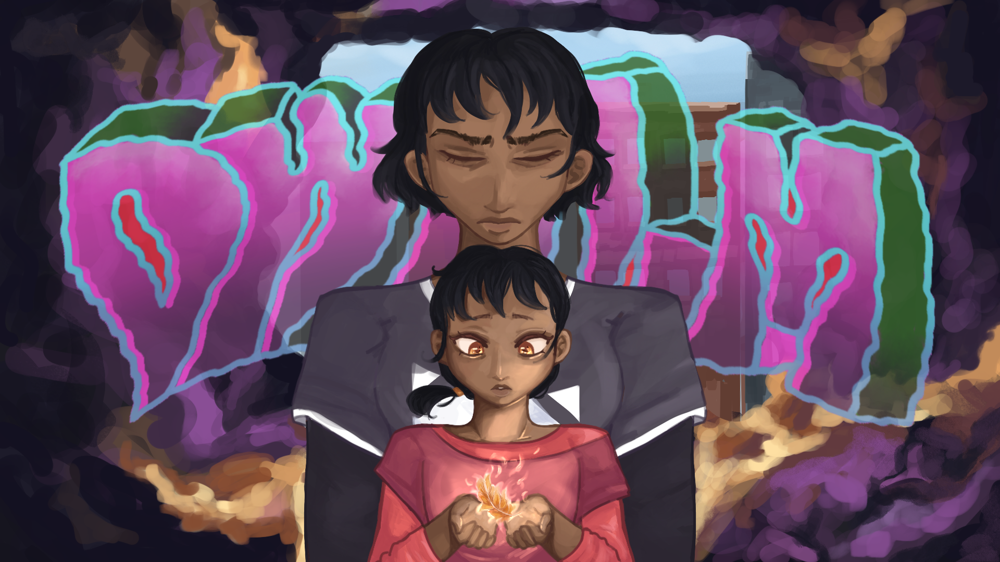
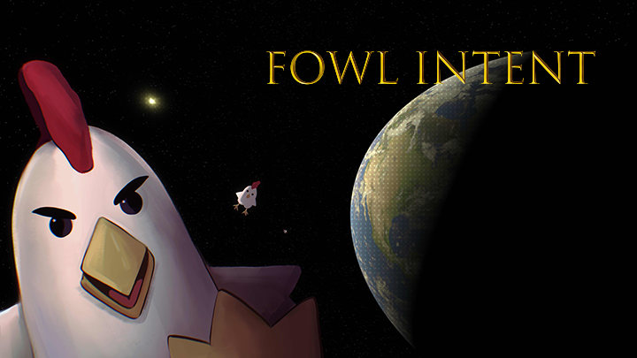
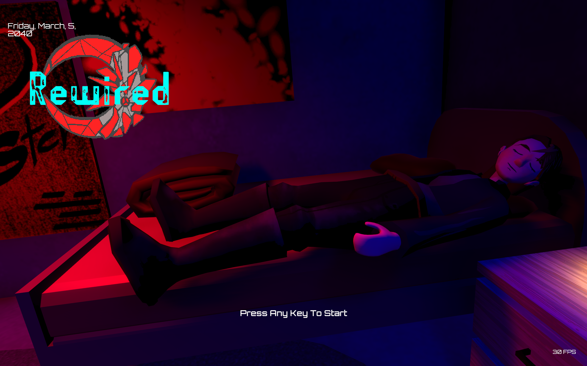
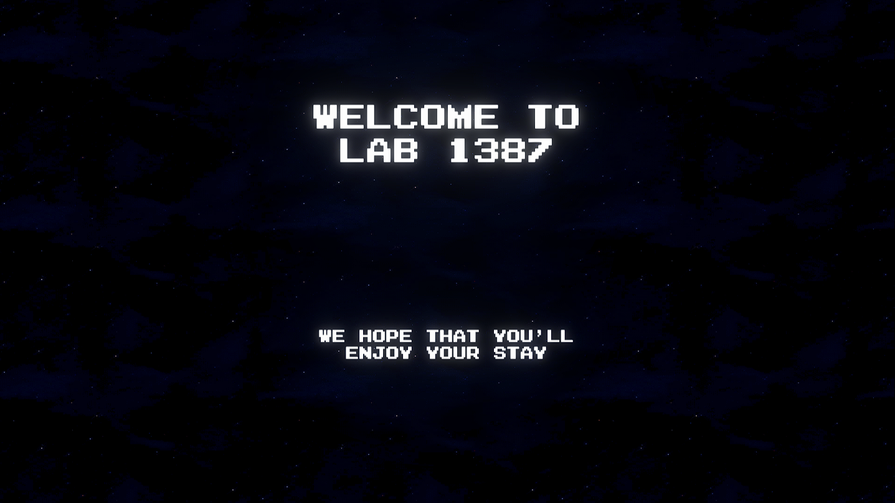
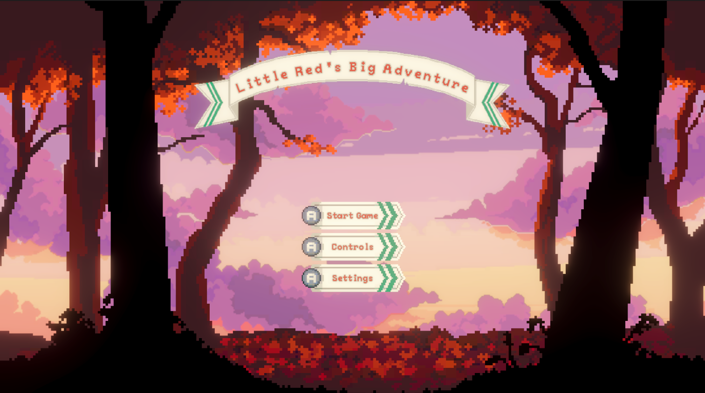
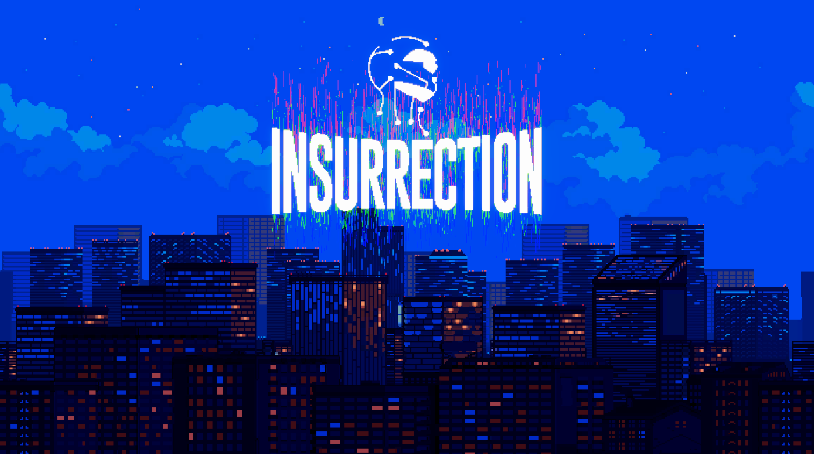

# Links To Socials
| Instagram | Blue Sky | Twitter | Itch.io | Github | Discord |
| :-------- | :------- | :------ | :------ | :----- | :------ |
|  |  |  |  |  |  |

# Featured Games

|  |  |  |
| :----------------------------------------------- | :----------------------------------------------- | :----------------------------------------------- |
| [Dwalm](https://samura1n1ja84.itch.io/dwalm)     | [Fowl Intent](https://samura1n1ja84.itch.io/fowl-intent) | [Rewired](https://samura1n1ja84.itch.io/rewired) |
| A narrative-heavy 3D platformer set within a Dream-Intertwined City | A FPS-Platformer But With Chickens | A Journey To Get Your Memories Back From A Compromised Therapist |
| Platformer                                       | Action                                           | Adventure                                        |
| English, Spanish, Italian, French, German, Portuguese, Arabic, Korean, Japanese, Chinese | English  | English                                          |
|  |  |  |

|  |  |  |
| :----------------------------------------------- | :----------------------------------------------- | :----------------------------------------------- |
| [Lab 1387](https://samura1n1ja84.itch.io/lab-1387) | [Little Red's Big Adventure](https://samura1n1ja84.itch.io/little-reds-big-adventure) | [Insurrection](https://samura1n1ja84.itch.io/insurrection) |
| Play As A Scientist Preparing For A Deadly Experiment | A Wave-Based Arena Platformer | Figure out what happened to your Father's Lab and what the City has to lose |
| Interactive Fiction                              | Action                                           | Adventure                                        |
| English                                          | English                                          | English                                          |
|  |  |  |

# Open-Source Tools
(Also Used In Above Unity Projects)

*   [Thimble : Wrapper For Yarn Spinner For Unity](https://github.com/samuraininja84/Thimble)
*   [World Shaper : Scene Management Framework For Adventure-based Games](https://github.com/samuraininja84/WorldShaper)
*   [Sanctuary : Custom Save / Load System For Unity](https://github.com/samuraininja84/UnityPackages/blob/main/Custom/Sanctuary.unitypackage)
*   [Puppeteer : Framework For Taking Control From The Player](https://github.com/samuraininja84/Puppeteer)